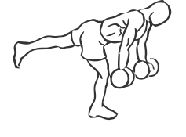
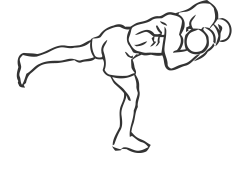

# Stork Stance Bicep Curl with Dumbbells

> This is an advanced exercise that requires excellent coordination and balance.

``` 
id: 0268 
type: isolation 
primary: biceps brachii 
secondary: quadriceps,ischiocrural muscles,glutaeus maximus,gastrocnemius,soleus,triceps brachii 
equipment: dumbbell 
``` 


## Steps


 - Grasp a pair of dumbbells in each hand, palms facing up.
 - Standing on one foot, extend your other foot back (see illustration) and extend your arms down so they are handing in front of your leg.
 - While on one foot, curl your arms up contracting your biceps.
 - Return to the starting position and switch legs.
 - Note: Have a Personal Trainer or Instructor show you how to properly perform this exercise.

## Tips


## Images





