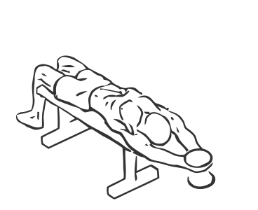
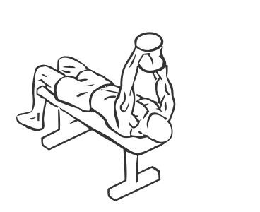

# Straight Arm Dumbbell Pullover

> This is an exercise for chest and shoulder strengthening which mainly targets the rotator cuff muscles.

``` 
id: 0079 
type: isolation 
primary: pectoralis major 
secondary: triceps brachii,latissimus dorsi,deltoid 
equipment: flat bench, dumbbell 
``` 


## Steps


 - Lie on a flat bench with your feet flat on the floor and your head at the end of the bench.
 - Grasp a dumbbell and raise it over your chest.
 - Keeping your elbows as straight as possible, lower the weight in an arc over your head and as low to the ground as possible with out any pain.
 - Return to starting position.
 - Repeat.

## Tips


## Images





