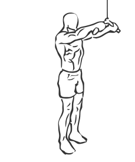
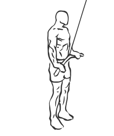

# Straight Arm Push Down

> This exercise for strengthening the Lats and also works the Triceps.

``` 
id: 0092 
type: isolation 
primary: latissimus dorsi 
secondary: triceps brachii 
equipment: cable 
``` 


## Steps


 - Grasp wide grip pull down bar with a wide grip so your hands are on the portion of the bar which curves down.
 - Stand erect with your abs drawn in.
 - Keeping a slight bend in your elbows and your wrist steady pull the bar down from the starting position to your upper thighs.
 - With a controlled motion bring the bar back up to starting position.

## Tips


## Images





