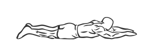
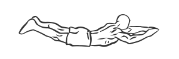

# Supermans

> This is an excellent exercise and a stretch for the lower back and core muscles.

``` 
id: 0105 
type: isolation 
primary: erector spinae 
secondary: core 
equipment: body 
``` 


## Steps


 - Lie flat on your stomach with your arms stretched out in front of you.
 - Raise your arms and legs off the floor and hold this position for 2 seconds.
 - Return to the starting position on the floor.
 - Repeat.

## Tips


## Images





