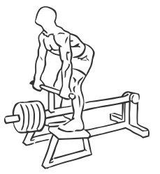
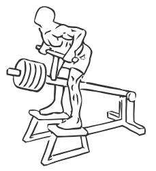

# T-Bar Rows

> This is an exercise for middle back, biceps and shoulder strengthening.

``` 
id: 0029 
type: isolation 
primary: latissimus dorsi 
secondary: biceps brachii,deltoid 
equipment: t-bar machine 
``` 


## Steps


 - Place your feet on either side of a T-Bar Machine.
 - With your knees slightly bent and abs drawn in, grasp the handles with a narrow grip.
 - Bend at the waist so your chest is parallel to the floor, this is starting position. Slowly pull the bar to your chest, as high as you can.
 - Pause at the top for a moment and then lower the bar to starting position.
 - Repeat

## Tips


 - Keep your back straight throughout this exercise in order to prevent injury.
 - Keep your elbows close to your body throughout the exercise.

## Images





