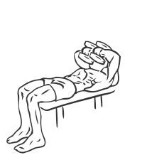
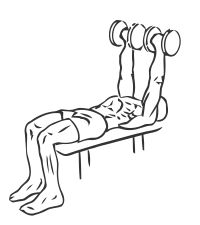

# Tate Press with Dumbbell

> This is an advanced triceps exercise which moves the muscle differently than other exercises.

``` 
id: 0203 
type: isolation 
primary: triceps brachii 
secondary:  
equipment: dumbbell 
``` 


## Steps


 - Lay flat on a bench with your head at one end and your feet firmly planted on the floor.
 - Hold a dumbbell in each hand so your palms are facing your feet.
 - Drawing your abs in and keeping your back on the bench, raise the weights to the center of your chest.
 - Without moving elbows, slowly raise your arms up and out contracting your triceps.

## Tips


## Images





