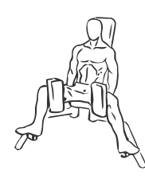
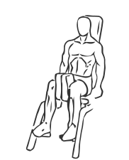

# Thigh Adductor

> This exercise targets and works the muscles of the inner thigh.

``` 
id: 0157 
type: isolation 
primary: quadriceps 
secondary: ischiocrural muscles 
equipment: machine 
``` 


## Steps


 - Sit on the machine and place your knees against the pads.
 - Draw your abs in and “adduct” or move your thighs together.
 - Slowly return to the starting position and repeat.
 - Note: Maintain the same level of resistance throughout this exercise for best results.

## Tips


## Images





