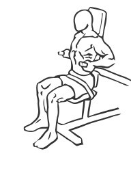

# Triceps Dips: Machine

> This exercise uses a machine to work the triceps while in seated position.

``` 
id: 0171 
type: compound 
primary: triceps brachii 
secondary: deltoid 
equipment: machine 
``` 


## Steps


 - Adjust the seat of the machine so that the handles are equal with your elbows.
 - Grasping the handles, press down with equal pressure until your arms are fully extended.
 - Pause, and then return to the starting position.

## Tips


## Images




