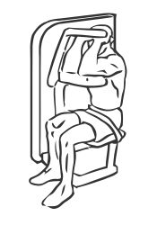
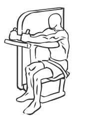

# Triceps Extension: Machine

> This exercise uses a machine to insure proper range of motion for tricep extensions.

``` 
id: 0210 
type: isolation 
primary: triceps brachii 
secondary:  
equipment: machine 
``` 


## Steps


 - Name: This exercise uses a machine to insure proper range of motion. This is a good exercise for beginners and people rehabilitating from injury.
 - Adjust the seat height of the machine so your upper arms and elbows lie flat on the pad. Draw your abs in and sit upright with your back straight. With your arms fully extended grasp the handles and pull them towards your body. Hold for a moment and then slowly return to the starting position.
 - Note: Stay seated and keep your feet firmly on the floor throughout this exercise.

## Tips


## Images





