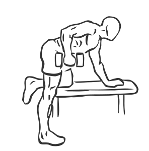

# Triceps Kickback with Dumbbell

> This along with the Triceps Push Down is one of the most beneficial exercises for the arms.

``` 
id: 0204 
type: isolation 
primary: triceps brachii 
secondary:  
equipment: dumbbell 
``` 


## Steps


 - Standing along side a flat bench, bend your left knee and place it on the bench.
 - Place your left hand on the bench for support, keeping your back at a 45 degree angle.
 - Hold a dumbbell in your right hand and place your right foot on the floor.
 - Bend your right arm and raise it up to your shoulder, then with controlled motion kick it back, fully extending your arm.
 - Switch arms and repeat.
 - Note: Keep your elbow close to your body during this exercise.

## Tips


## Images




