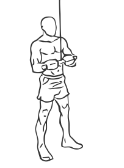
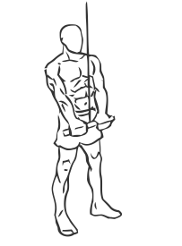

# Triceps Pushdown: Cable

> This exercise is the original version of the triceps pushdown.

``` 
id: 0205 
type: isolation 
primary: triceps brachii 
secondary:  
equipment: cable 
``` 


## Steps


 - Stand in front of a cable machine and attach a short bar to a high pulley.
 - Grasp the handle with your palms facing down.
 - Draw your abs in and keep your back straight.
 - Keeping your elbows at your side push the handle down towards your thighs.
 - Pause for a moment and then return to the starting position.
 - Note: You may want to stager one foot in front of the other for a better stance.

## Tips


## Images





