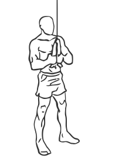
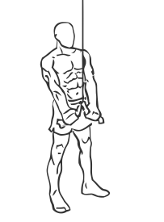

# Triceps Pushdown: Cable (Rope)

> This version of the triceps pushdown uses a rope for better definition in the muscle.

``` 
id: 0206 
type: isolation 
primary: triceps brachii 
secondary:  
equipment: cable 
``` 


## Steps


 - Stand in front of a cable machine and attach a rope to a high pulley.
 - Grasp the rope with palms facing down.
 - Draw your abs in and keep your back straight.
 - Keeping your elbows at your side push the rope down towards your thighs, if possible “split” the rope apart at the bottom.
 - Pause for a moment and then return to the starting position.
 - Note: You may want to stager one foot in front of the other for a better stance.

## Tips


## Images





