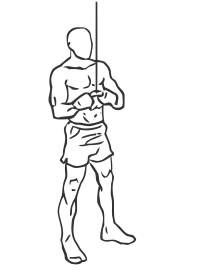
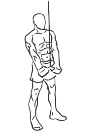

# Triceps Pushdown: Cable (V-Bar)

> This exercise is the triceps pushdown uses a V shaped bar.

``` 
id: 0207 
type: isolation 
primary: triceps brachii 
secondary:  
equipment: cable, v-bar 
``` 


## Steps


 - This exercise is the triceps pushdown uses a V shaped bar. Many people find this version easier on the elbows.
 - Steps
 - Stand in front of a cable machine and attach a V Bar to a high pulley.
 - Grasp the bar with palms facing down.
 - Draw your abs in and keep your back straight.
 - Keeping your elbows at your side push the bar down towards your thighs.
 - Pause for a moment and then return to the starting position.
 - Note: You may want to stager one foot in front of the other for a better stance.

## Tips


## Images





