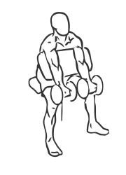
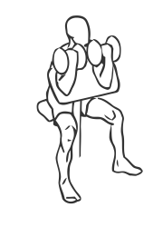

# Preacher Curl: Dumbbell (Two Arm)

> This version of a Preacher Curl uses a special bench and dumbbells.

``` 
id: 0249 
type: isolation 
primary: biceps brachii 
secondary: forearm 
equipment: dumbbell 
``` 


## Steps


 - A Preacher Curl uses a special bench to support the triceps and isolate the biceps to build the arms. This version of the exercise uses dumbbells.
 - Adjust the seat of the bench so your arms are level with the top of the bench.
 - Grasp a dumbbell in each hand with palms facing up.
 - Picking up the dumbbells, rest your arms against the bench and extend them fully towards the floor.
 - Keeping your arms on the bench at all times, curl the weight up towards your head.
 - Pause for a moment and then lower the weights back to starting position.
 - Note: Perform this exercise in a slow controlled manner for best results.

## Tips


## Images





