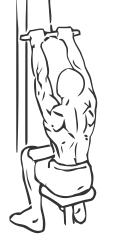
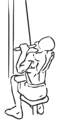

# Pull Down: Underhand

> This is an exercise for lats and biceps strengthening.

``` 
id: 0095 
type: isolation 
primary: latissimus dorsi 
secondary: biceps brachii 
equipment: cable 
``` 


## Steps


 - Sitting upright with your abs drawn in grasp a Pull Down bar with and underhand grip shoulder width apart.
 - Pull the bar down till the bar reaches your upper chest, keeping your elbows close to your body.
 - Slowly return the bar to the starting position.
 - Repeat.

## Tips


## Images





