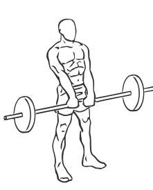
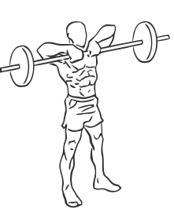

# Upright Barbell Rows

> This is an exercise for shoulder, biceps and upper back strengthening.

``` 
id: 0014 
type: isolation 
primary: deltoid 
secondary: biceps brachii,upper back 
equipment: barbell 
``` 


## Steps


 - Stand with your feet shoulder width apart, your abs drawn in and back straight.
 - Place the bar on rack in the position where your arms are fully extended in front of you with your elbows slightly bent.
 - Place your hands shoulder width apart and raise the bar up towards your chin with a controlled motion.
 - Pause at the top for a moment and rotate your shoulder blades together.
 - Lower the bar to the starting position.
 - Repeat

## Tips


 - Do not arch your back when raising the barbell towards your chin.

## Images





