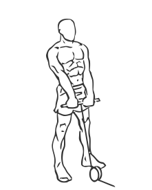
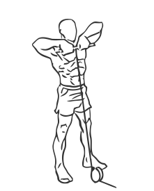

# Upright Cable Row

> This is an exercise for shoulder, biceps and upper back strengthening.

``` 
id: 0015 
type: isolation 
primary: deltoid 
secondary: upper back,biceps brachii 
equipment: cable 
``` 


## Steps


 - Attach a straight bar to the pulley on the floor.
 - Stand with your feet shoulder width apart, your abs drawn in and your back straight.
 - Grasp the bar with an overhand grasp (your palms facing downwards) and pull it up towards your waist, this is the starting position.
 - Raise the bar up to in line with your shoulders.
 - Pause at the top and rotate your shoulder blades together.
 - Lower the bar in a controlled motion to the starting position.

## Tips


 - Do not arch your back when raising the bar to your shoulders.

## Images





