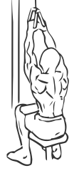

# Pull Down: V Bar 

> This is an exercise for lats, biceps and middle back strengthening.

``` 
id: 0096 
type: isolation 
primary: latissimus dorsi 
secondary: biceps brachii 
equipment: cable 
``` 


## Steps


 - Attach a V bar to the pull down pulley of a cable machine.
 - Sitting upright with your abs drawn grasp the bar with an overhand grip, your palms facing in.
 - Pull the bar straight down to your upper chest.
 - Pause for a moment after touching the chest and then slowly return the bar to starting position.
 - Repeat.

## Tips


## Images




