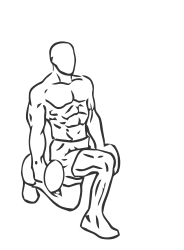
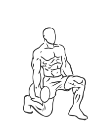

# Lunges: Dumbbell (Walking)

> A walking lunge gives you the benefit of lunges plus core muscle training from the constant motion.

``` 
id: 0121 
type: isolation 
primary: ischiocrural muscles 
secondary: quadriceps,glutaeus maximus,gastrocnemius,soleus 
equipment: dumbbell 
``` 


## Steps


 - Start by grasping a dumbbell in each hand.
 - Stand with your feet about 8 inches apart, toes facing forward.
 - Take a lunge forward keeping your abs drawn in and your upper body straight.
 - Slowly lower one knee down as if kneeling while keeping your other knee bent at a 90 degree angle, do not let your knee touch the ground.
 - Lower your body to just above the floor and hold for a moment before pushing off with the back foot.
 - Step through and repeat the exercise with the other leg.

## Tips


 - Practice the walking lunge without any weights until you are comfortable with the movements.

## Images





