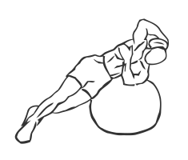
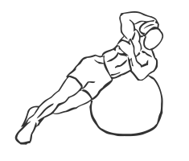

# Weighted Ball Side Bend

> This exercise use a Stability Ball instead of a bench to work the obliques.

``` 
id: 0208 
type: isolation 
primary: obliques 
secondary:  
equipment: weight, exercise ball 
``` 


## Steps


 - This exercise use a Stability Ball instead of a bench. The Stability Ball conforms better to your body and allows for correct anatomical range of movement.
 - Lie one side of your torso, and with your waist and hip against a Stability Ball, position your feet on the floor (or against a wall) for support.
 - With one hand, hold a weight against the side of your head.
 - Place your free hand across your chest to steady yourself.
 - Raise your torso up off the ball by flexing your waist.
 - With controlled movements lower yourself back onto the ball.

## Tips


## Images





