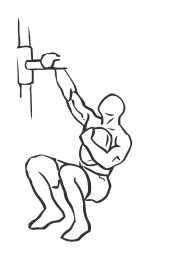
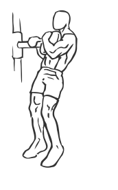

# Weighted Sissy Squat with Weight Plate

> Don't let the name of this exercise fool you, it is a an assisted squat which effectively works the quadriceps.

``` 
id: 0158 
type: isolation 
primary: quadriceps 
secondary:  
equipment: weight plate 
``` 


## Steps


 - Don't let the name of this exercise fool you, it is a an assisted squat which effectively works the quadriceps (leg muscles).
 - Grasp a weight rack or bar for support with one arm and hold a free weight plate across your chest with your other hand.
 - With your abs drawn in, squat down lowering your body to the floor until your knees are almost fully flexed.
 - Return to the starting position.
 - Note: Keep your feet placed firmly on the floor throughout this exercise.

## Tips


## Images





