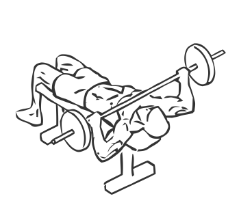
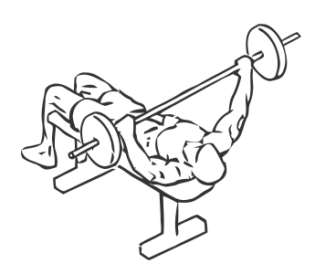

# Bench Press: Barbell (Wide Grip)

> This is an exercise for chest, triceps and shoulder strengthening.

``` 
id: 0082 
type: isolation 
primary: pectoralis major 
secondary: triceps brachii,deltoid 
equipment: flat bench, barbell 
``` 


## Steps


 - Lie flat on a bench with your feet flat on the floor.
 - Place your hands wider than shoulder width apart on the bar and lift it off the rack, this is starting position.
 - Bring the bar over your chest and lower it till it is just above your body.
 - Extend your arms upward and raise the bar straight up.
 - Pause for a moment and with slow controlled movement, return the bar to starting position.
 - Repeat.

## Tips


 - Ensure that your hips and back remain in contact through out the exercise.

## Images





