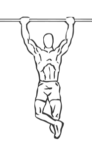

# Wide Grip Chin Up

> This variation on the basic chin up is a great exercise for people who rock climb.

``` 
id: 0091 
type: isolation 
primary: trapezius 
secondary: trapezius,biceps brachii 
equipment: body, pull-up bar 
``` 


## Steps


 - Grasp a chin up bar with a slightly wider than shoulder width grip.
 - Keeping your body straight pull yourself up and to one side of the bar.
 - Lower your body back down to the starting position.
 - Raise yourself to the other side of the bar.
 - Repeat.

## Tips


 - Ensure to hang dow completely before alternating to the other side.

## Images




