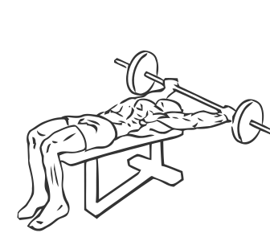
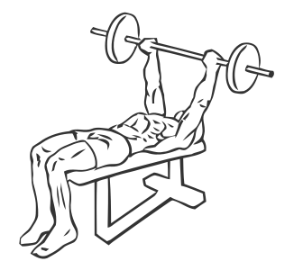

# Wide Grip Decline Barbell Pullover

> This is an advanced strengthening exercise which targets the pectoral or chest muscles.

``` 
id: 0064 
type: isolation 
primary: pectoralis major 
secondary:  
equipment: bench: decline, barbell 
``` 


## Steps


 - Lie on a decline bench with your feet higher than your head and your feet firmly on the ground.
 - Grasp the barbell with an extra wide grip (your hands near the plates) and starting at you’re your upper thighs raise the barbell in an arc over your head towards the floor.
 - Slowly return the barbell to starting position on your thighs.
 - Repeat.

## Tips


 - Ensure your back and hips remain in contact with the bench at all times.

## Images





