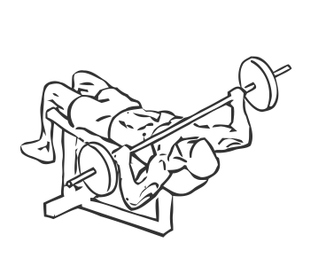
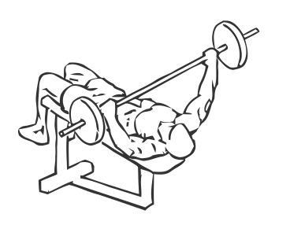

# Bench Press: Barbell (Decline, Wide Grip)

> This is an exercise for chest, triceps and shoulder strengthening.

``` 
id: 0083 
type: isolation 
primary: pectoralis major 
secondary: triceps brachii,deltoid 
equipment: barbell, bench: decline 
``` 


## Steps


 - Lie on a decline bench with your head lower than your feet.
 - Place your hands wider than shoulder width apart on the bar and lift it off the rack.
 - Bring the bar over your chest and lower it till it is just above the lower portion of your chest, this is starting position.
 - Extend your arms upward and raise the bar straight up.
 - Pause for a moment and then lower the bar to starting position.
 - Repeat.

## Tips


## Images





