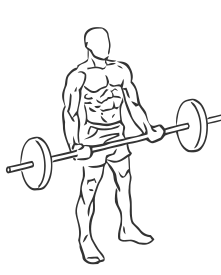
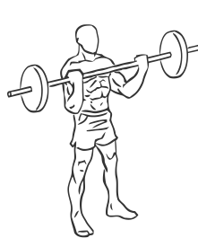

# Wide Grip Standing Biceps Curl with Barbell

> This is a wide grip version of a biceps curl.

``` 
id: 0250 
type: isolation 
primary: biceps brachii 
secondary: forearm 
equipment: barbell 
``` 


## Steps


 - This is a wide grip version of a biceps curl. The wider grip targets the lateral or outer portion of the muscle.
 - Stand with your feet shoulder width apart, your knees slightly bent and your abs drawn in.
 - Grasp a barbell with palms up as wide as you comfortably can.
 - Extend your arms fully against your thighs.
 - Keeping your elbows straight, raise the bar towards your chest until your forearms touch your chest.
 - Pause for moment and then return to the starting position.
 - Note: Lean up against a wall or post if you have problems keeping from swinging.

## Tips


## Images





