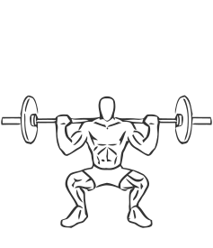
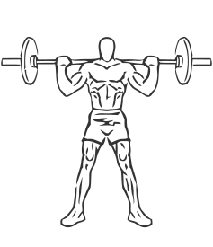

# Wide Stance Squat with Barbell

> This version of the squat uses a wider stance to isolate the inner thigh.

``` 
id: 0160 
type: compound 
primary: quadriceps 
secondary: gastrocnemius,soleus,ischiocrural muscles 
equipment: barbell 
``` 


## Steps


 - Lifting a barbell off of a weight rack, position it on your shoulders.
 - Stand with your feet wider than shoulder width apart (about 30 inches apart) with your toes pointing out.
 - Drawing your abs in descend slowly by bending at the knees and hips as if you are sitting down (squatting).
 - Lower yourself as far as you can control without letting your body shift towards your toes (this will cause you to loose balance).
 - Pause in the downward position and slowly return upright to the starting position.
 - Note: A pad on the bar or towel on your shoulders can help improve your grip and reduce the discomfort of the bar against your back. Practice the squat without any weight to allow yourself to become comfortable with the movements.

## Tips


## Images





