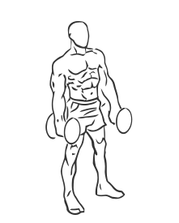
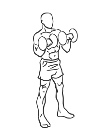

# Zottman Curl with Dumbbells

> This is an advanced exercise where you turn the dumbbells up and out.

``` 
id: 0251 
type: isolation 
primary: biceps brachii 
secondary: forearm 
equipment: dumbbell 
``` 


## Steps


 - Stand with your feet shoulder width apart, your knees slightly bent and your and your abs drawn in.
 - Grasp a dumbbell in each hand with your palms facing each other.
 - Start with your hands at your sides.
 - Curl your arms up turning your wrists so they are facing down as the dumbbells reach your chest.
 - Pause for a moment and then return to the starting position.

## Tips


## Images





