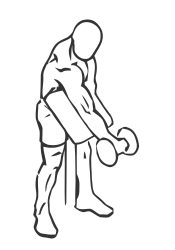
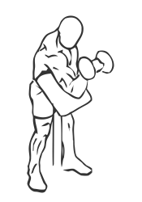

# Preacher Curl: Dumbbell (Zottman)

> This is an advanced exercise where you turn the dumbbells up and out using a Preacher Curl bench for support.

``` 
id: 0252 
type: isolation 
primary: biceps brachii 
secondary: forearm 
equipment: dumbbell 
``` 


## Steps


 - Sit at a Preacher Curl Bench.
 - Grasp a dumbbell in your hand with your palms facing up.
 - Extend your arm fully along the bench.
 - Curl your arm up turning your wrist so it faces down as the dumbbell reaches your chest.
 - Pause for a moment and then return to the starting position and switch arms.

## Tips


## Images





